# Input-Fetcher (WORK IN PROGRESS...)
<a href="https://vimeo.com/812094804/6a98ec1dad">WATCH INTRO VIDEO</a> 
## What it does:

Input-Fetcher is a node organization system for the Foundry Nuke, which works on the idea of INPUTs and OUTPUTs.
  
It's a great solution for compositors who are looking to speed up their workflow and improve their script organization and mental clarity.

## Try the demo without installing:
Copy the contents of the demo.py and paste it into a new Nuke session's node graph. 
A brief introduction of Input Fetcher's features is laid out at the top of the script. 
Along with a mock script for testing things out! 
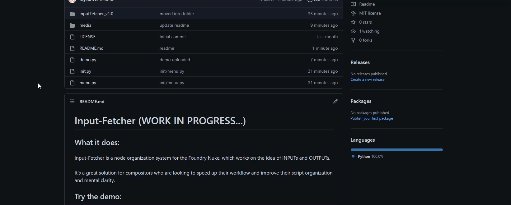
 
## Installation: 
Downloading the inputFetcher_Zip.7z file and extract its contents. 

1. Go to your .nuke folder. 
2. Copy contents of init.py into your init.py. 
3. Copy contents of menu.py into your menu.py. 
4. Move the inputFetcher_v1.0 folder and its contents into your .nuke folder. 
5. OPTIONAL: In InputFetcherConfig.py, change the "_NODE_CLASS" value from 'Dot' to 'NoOp' if that's what you prefer! 
6. Launch Nuke and "Shift + N"!

## Quick Start Reference: 
Tag examples: 
'tag' - default tag command, will use tagged node's name as label. 
'tag new_label' - will use 'new_label' as tagged node's label. 
'tag lens dirt 35mm' - will use 'lens dirt 35mm' as tagged node's label. 
'untag' - untag node. 
 
Fetch examples: 
'OUT_PLATE_NATIVE' - create an output for category 'PLATE' named 'NATIVE'. 
'OUT_CAM_MAIN' - create an output for category 'CAM' named 'MAIN'. 
'OUT_MATTE_FG_CHAR_01' - creates an output for category 'MATTE' named 'FG_CHAR_01'. 
'OUT_SHIP_FLAG_03' - creates an output for category 'SHIP' named 'FLAG_03'. 
 
 
## How to use:

To call Input-Fetcher, use the hotkey "SHIFT + N" in Nuke:
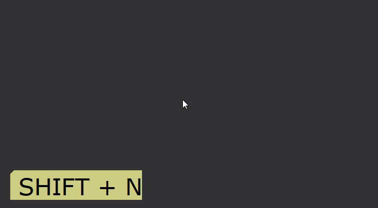

Input-Fetcher has different functionality based on context.
There are three contexts:
1. Labeller
2. Input/Output
3. Commands

## Labeller Context

Currently, we don't have any nodes selected, so it will by default create a "Dot" node and set the input text as its label: 
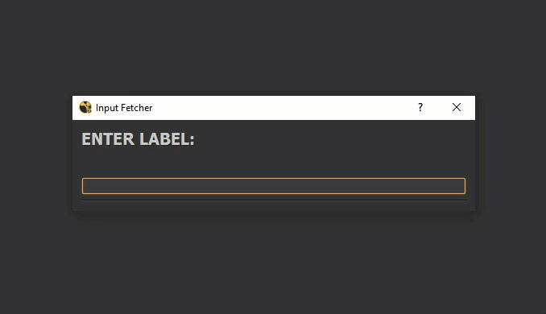

If we call Input-Fetcher with a node selected however, any input we enter will be applied to the node as its label: 
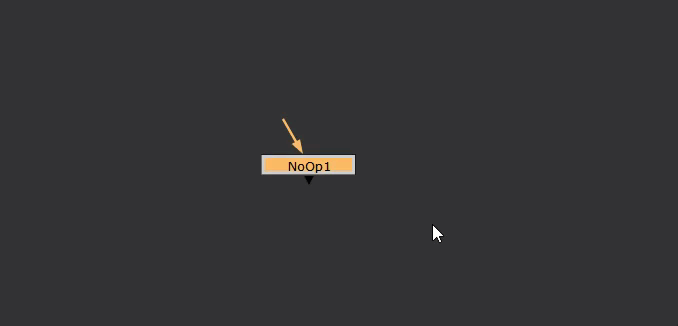

If multiple nodes are selected, all will receive the same label: 
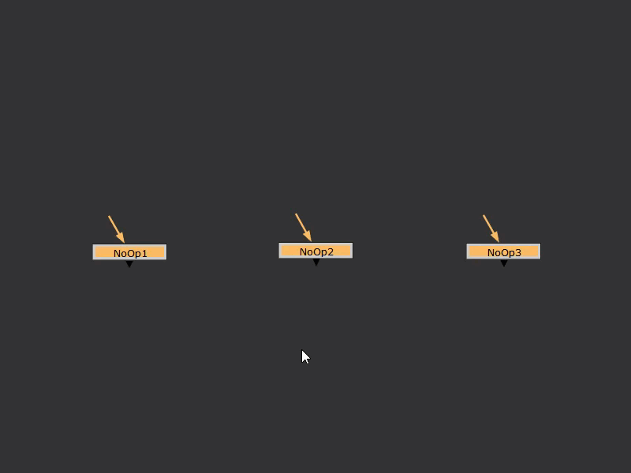

## Input / Output Context: 
Creating INPUTs and OUTPUTs is the main functionality of Input-Fetcher. 
To create an OUTPUT, we need to use this syntax: 

<b>"OUT_PREFIX_LABEL"</b>

Here are the default prefixes that Input-Fetcher recognizes:

PLATE 
MATTE 
RENDER 
DEEP 
CAM 
GEO 

To create an OUTPUT for a plate, we can enter <b>"OUT_PLATE_NATIVE"</b>:

Calling Input-Fetcher again, the newly created OUTPUT node will be visible in the UI, clicking it will create an INPUT node:
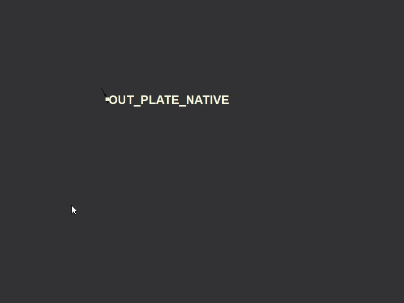

We can also create INPUT nodes by copy and pasting OUTPUT nodes:
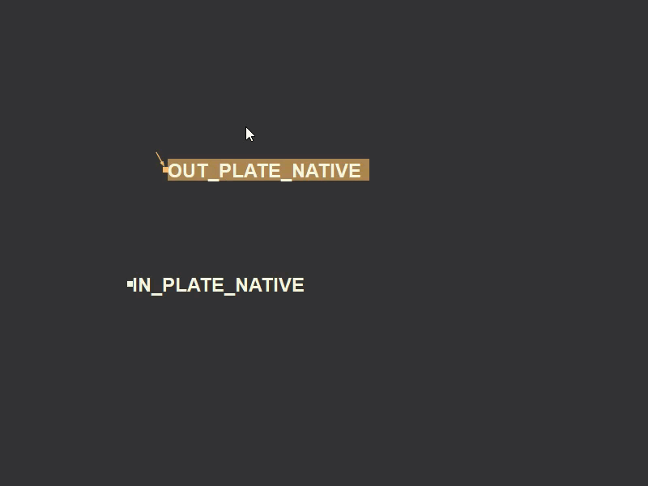

Or by copy and pasting other INPUT nodes:
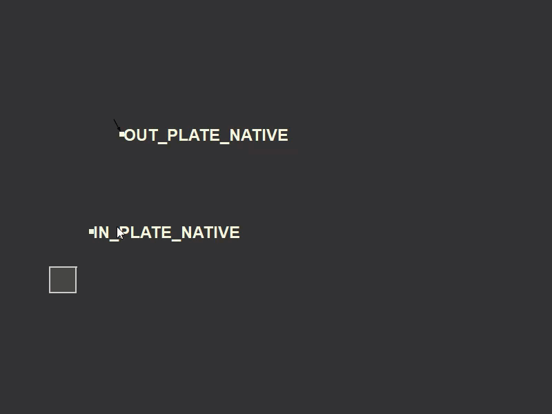

Or by converting one or more dot nodes:
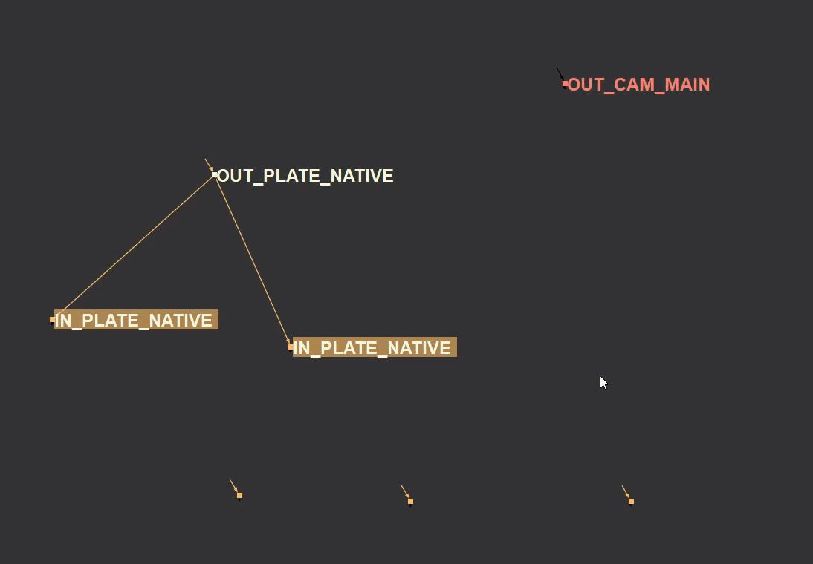

Renaming an OUTPUT will update its children:
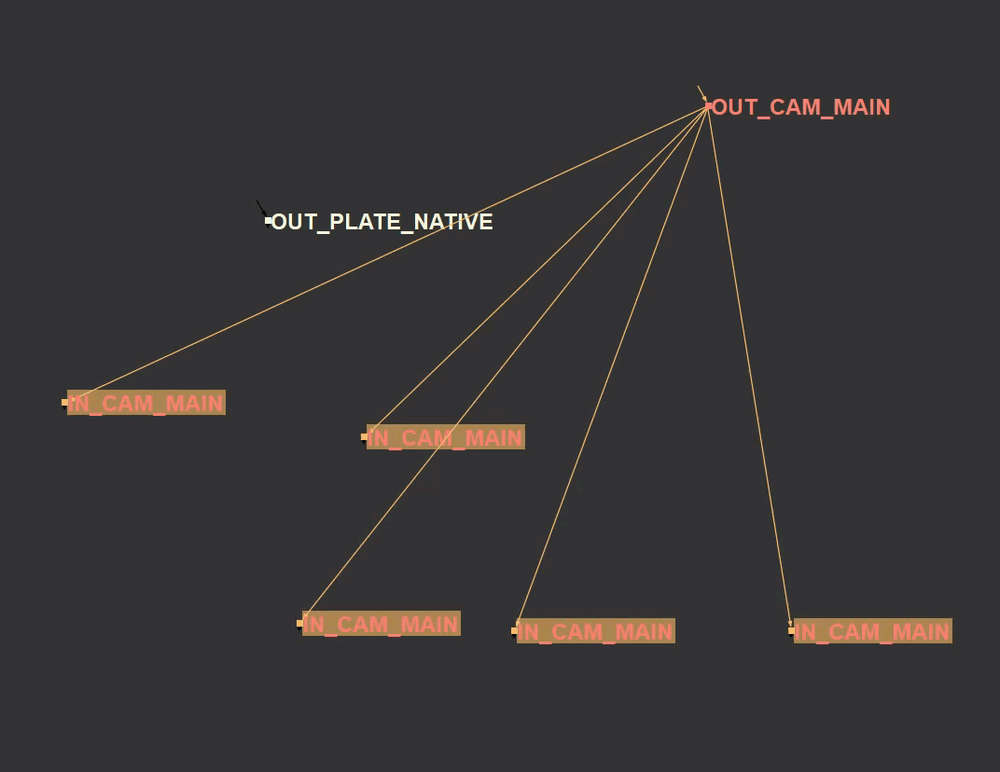

Use the hotkey "CTRL + C" to connect disconnected inputs:
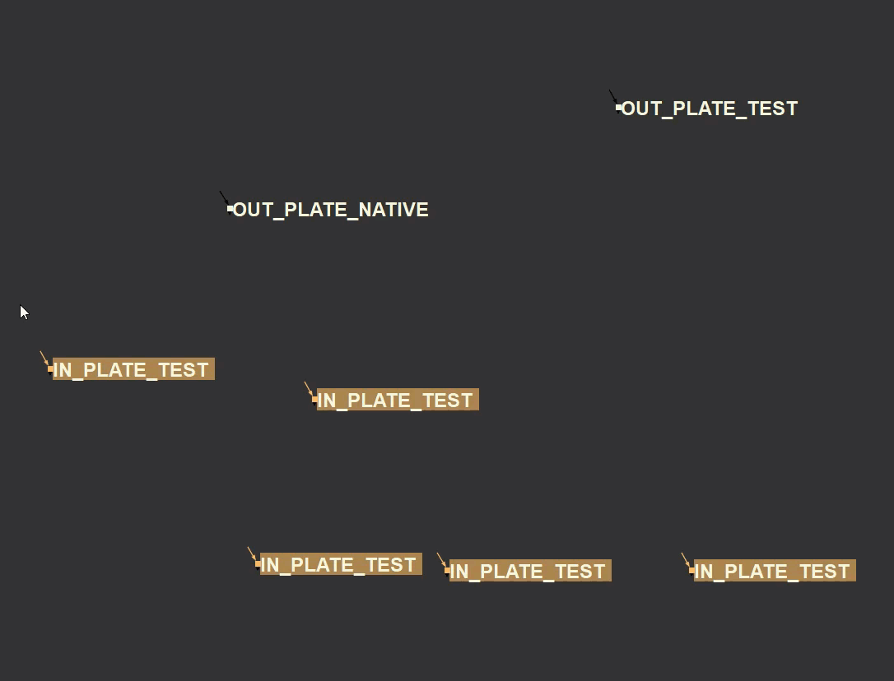
