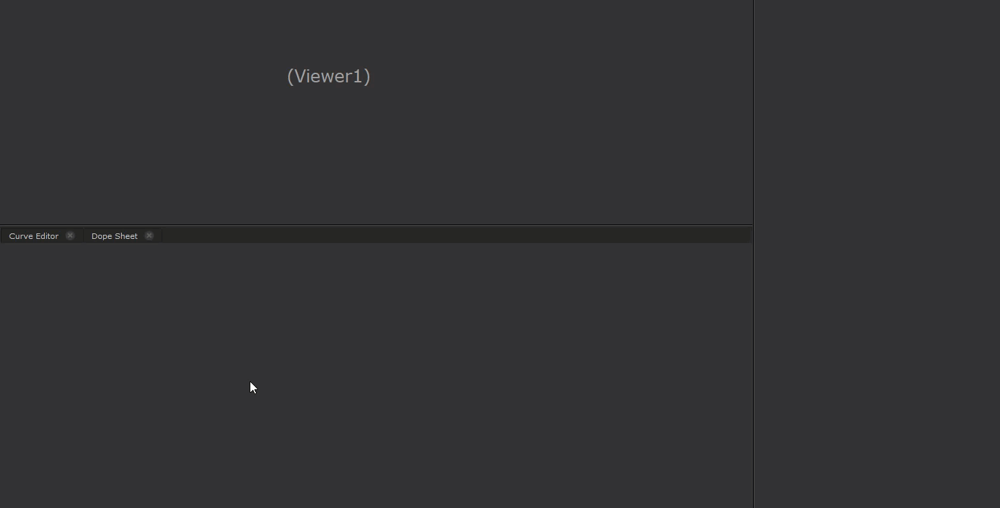

# Input-Fetcher

### What it does:
Input-Fetcher is a node organization system for the Foundry Nuke.

### How to use:
The Input-Fetcher systems works on the idea of INPUTs and OUTPUTs.
 Where OUTPUTs are parent nodes and INPUTs are child nodes.

To call Input-Fetcher, use the hotkey "SHIFT + N" in Nuke.

To create a new OUTPUT node:

