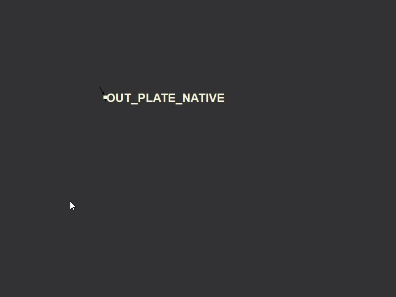
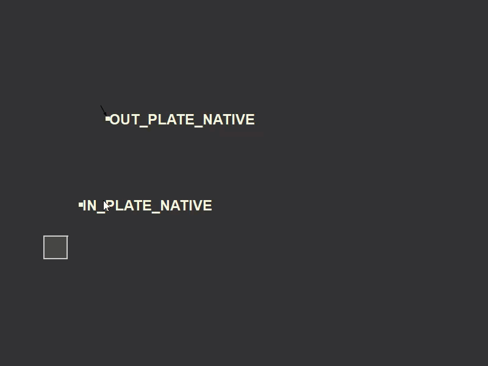

# Input-Fetcher

## What it does:

Input-Fetcher is a node organization system for the Foundry Nuke, which works on the idea of INPUTs and OUTPUTs.
 

## FAQ commands:</b>
Tag examples:</b>
'tag' - default tag command, will use tagged node's name as label.</b>
'tag new_label' - will use 'new_label' as tagged node's label.</b>
'untag' - untag node.</b>
</b>
Fetch examples:</b>
'OUT_PLATE_NATIVE' - create an output for category 'PLATE' named 'NATIVE'.</b>
'OUT_CAM_MAIN' - create an output for category 'CAM' named 'MAIN'.</b>
'OUT_MATTE_FG_CHAR_01' - creates an output for category 'MATTE' named 'FG_CHAR_01'</b>
'OUT_SHIP_FLAG_03' - creates an output for category 'SHIP' named 'FLAG_03'.</b>
</b></b>
## How to use:

To call Input-Fetcher, use the hotkey "SHIFT + N" in Nuke:

Input-Fetcher has different functionality based on context.
There are three contexts:
1. Labeller
2. Input/Output
3. Commands

## Labeller Context

Currently, we don't have any nodes selected, so it will by default create a "Dot" node and set the input text as its label:

If we call Input-Fetcher with a node selected however, any input we enter will be applied to the node as its label:

If multiple nodes are selected, all will receive the same label:

### Input/Output Context:
Creating INPUTs and OUTPUTs is the main functionality of Input-Fetcher. 
To create an OUTPUT, we need to use this syntax: 

<b>"OUT_PREFIX_LABEL"</b>

Here are the default prefixes that Input-Fetcher recognizes:

PLATE 
MATTE 
RENDER 
DEEP 
CAM 
GEO 

To create an OUTPUT for a plate, we can enter <b>"OUT_PLATE_NATIVE"</b>:

Calling Input-Fetcher again, the newly created OUTPUT node will be visible in the UI, clicking it will create an INPUT node:

We can also create INPUT nodes by copy and pasting OUTPUT nodes:

Or by copy and pasting other INPUT nodes:

Or by converting one or more dot nodes:
