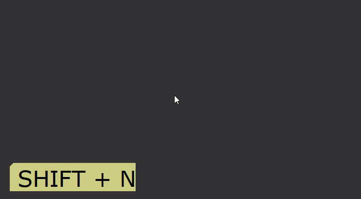
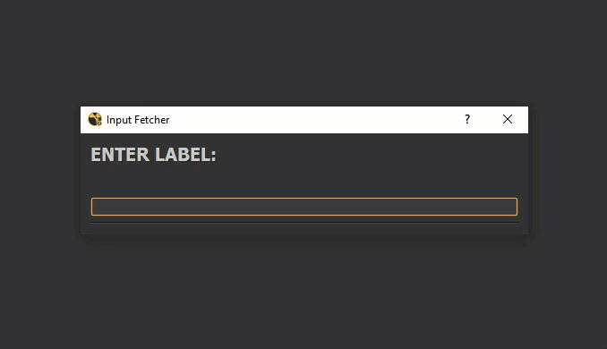
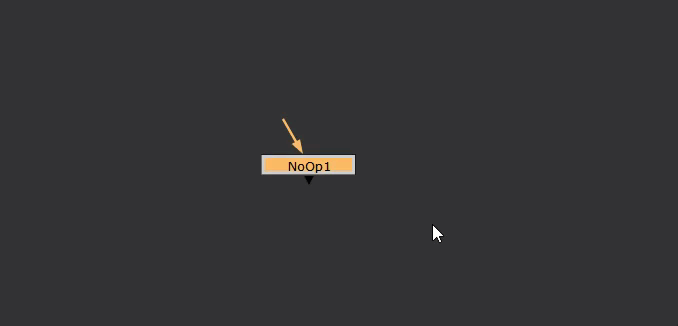
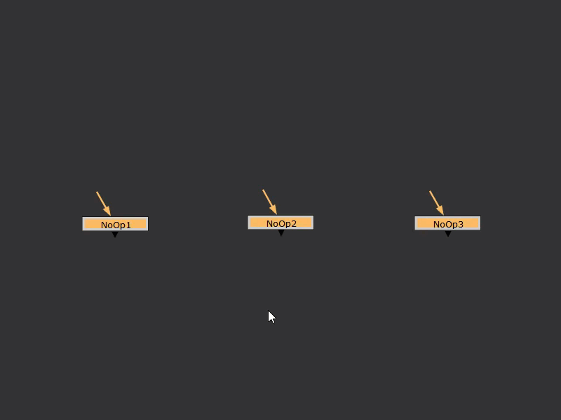

# Input-Fetcher

## What it does:

Input-Fetcher is a node organization system for the Foundry Nuke, which works on the idea of INPUTs and OUTPUTs.
 

## How to use:

To call Input-Fetcher, use the hotkey "SHIFT + N" in Nuke:

Input-Fetcher has different functionality based on context.
There are three contexts:
1. Labeller
2. Input/Output
3. Commands

### Labeller Context

Currently, we don't have any nodes selected, so it will by default create a "Dot" node and set the input text as its label:

If we call Input-Fetcher with a node selected however, any input we enter will be applied to the node as its label:

If multiple nodes are selected, all will receive the same label:

To create an INPUT node: